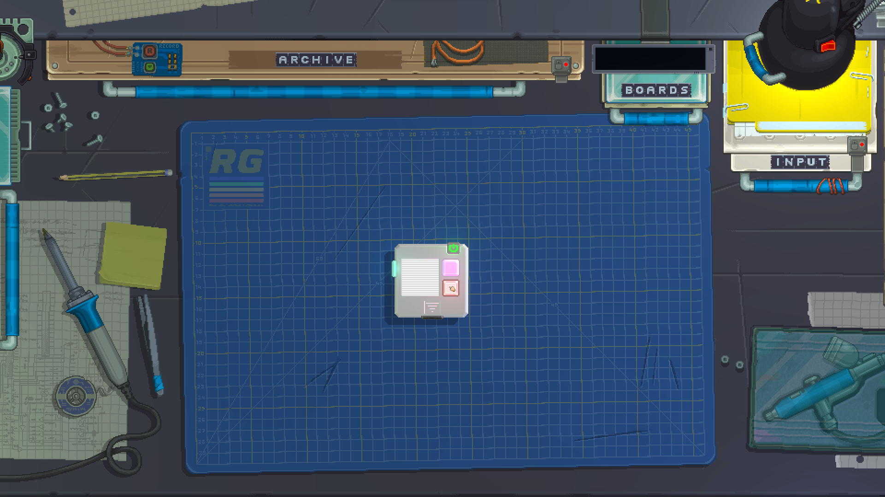
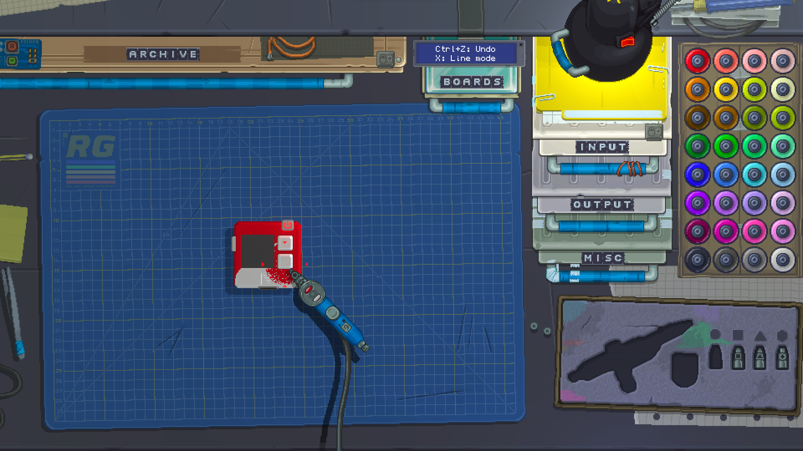

# Desk

The Desk is the main environment in Retro Gadgets, and is where you assemble or use your gadgets. **While visible, you can hold left shift to zoom in.**

|     | Name              | Description                                                                                                                                                                                                                                                |
| ---:| ----------------- | ---------------------------------------------------------------------------------------------------------------------------------------------------------------------------------------------------------------------------------------------------------- |
|   1 | Cutting Mat       | A visual representation of the main playspace. Gadgets reside upon it. You can change the design using the Mat tab `(14)` if you've added custom designs.                                                                                                  |
|   2 | Tweezers          | The Tweezers are used to pick up placed stickers. They can then be rearranged or dragged to the Sticker Printer `(6)` to be removed.                                                                                                                       |
|   3 | Soldering Iron    | The Soldering Iron is used to merge board pieces from the Boards Drawer `(10)` into larger shapes.                                                                                                                                                         |
|   4 | Multitool™        | The Multitool is a multipurpose menu, editor, and printer. You can code, draw, and manage your assets through it. Pulling its handle to the right will slide the camera over, switching from build to inspect mode. This is the default mode upon startup. |
|   5 | Sticky Note       | The sticky note displays an icon when the active gadget has been downloaded from the steam workshop.                                                                                                                                                       |
|   6 | Sticker Printer   | The Sticker Printer prints stickers, but will also recycle any printers dragged to it from the Tweezers `(2)`, removing them from your gadget.                                                                                                             |
|   7 | Recorder          | The Recorder is used to generate either full-screen videos or your gadgets, or automatic portrait mode videos for sharing on social networks.                                                                                                              |
|   8 | Archive           | The Archive contains gadgets on your system, sorted by last used. It is used to switch the active gadget, or to put away the current gadget in order to make a new one.                                                                                    |
|   9 | Minitool™         | The Minitool is a pager-like device, displaying information and important notices as you use your desk or gadgets.                                                                                                                                         |
|  10 | Boards Drawer     | The Boards Drawer is used to add boards to a gadget, which can then be merged together with the Soldering Iron `(3)`. These form the basis of all gadgets.                                                                                                 |
|  11 | Lamp              | The Lamp emits light, and can be toggled on and off. A gadget can set the Lamp's color, or toggle state.                                                                                                                                                   |
|  12 | Component Drawers | The three component drawers contain the Input, Output, and Misc components used to make gadgets. Most Misc chips can be placed on the back of boards.                                                                                                      |
|  13 | Airbrush          | The Airbrush allows you to paint your gadgets. Dragging it will activate drawing mode, shifting the camera over.                                                                                                                                           |
|  14 | Mat tab           | The Mat tab is visible when there is no active gadget, and allows you to toggle between custom mats.                                                                                                                                                       |

## Modes

### Build
Build is the default mode, where the Cutting Mat is centered and all drawers are accessible. In this mode a gadget is editable, and you can drag components to and from the drawers.

### Play
Play mode is entered by pressing the power button on a gadget. During it, drawers and the Airbrush are locked, but the Multitool is still available to switch to inspect mode. An alternate play mode that dismisses the desk can be entered by pressing `F11`. Both play modes end when the gadget is turned off by pressing the power button again.

### Inspect
Inspect mode is activated by opening the multitool with a gadget active. It can be used to debug CPU execution, or set properties and defaults on components.

### Drawing

Drawing mode is activated by grabbing the Airbrush. The camera will shift over to reveal a pallet and paint heads, which can be selected (colors with both left and right click for primary/secondary) to paint a gadget and its components. The mouse wheel will change paint size, and the Minitool displays additional controls. Paint does not go through stickers, allowing them to be used as stencils.

## Methods

Gadgets can manipulate the desk in two main places.

### Lamp

#### desk.GetLampState() `boolean`
Returns true is the lamp is on.

#### desk.SetLampState(state `boolean`)
Sets the lamp state to `state`, true for on.

#### desk.SetLampColor(color `color`)
Sets the color of the lamp to any color. **Will reset to white when play mode is exited.**

### Minitool

#### desk.ShowMessage(message `string`, persistent `boolean`)
Shows a message on the Minitool. Won't automatically clear if persistent is true. Uses a blue background.

#### desk.ShowWarning(message `string`, persistent `boolean`)
Same as `ShowMessage`, but with a yellow background.

#### desk.ShowError(message `string`, persistent `boolean`)
Same as `ShowMessage`, but with a red background.

#### desk.HideMessage()
Clear the Minitool message, turning the screen off.
