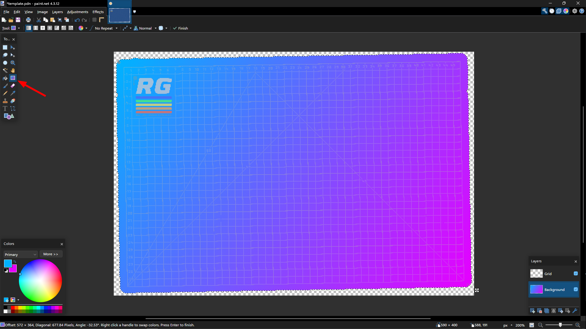
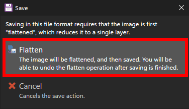

# Introduction to cutting mats
The cutting mat is where you build your gadgets.
You can change out your mats when no gadget is currently on it by clicking the mat tab in the bottom right corner of your current mat.

You can also make your own custom mats for your [Retro Desk](./../docs/desk.md), which this tutorial is focused on.

## Tutorial
In this tutorial we will be making this mat:

You can download the mat template for Gimp, Photoshop and Paint.NET here:
- [Gimp](./../assets/examples/cutting-mat-tutorial/template.xcf)
- [Photoshop](./../assets/examples/cutting-mat-tutorial/template.psd)
- [Paint.NET](./../assets/examples/cutting-mat-tutorial/template.pdn)

### Getting started

First, open the template in whatever photo editing software you'd like (I will be using [Paint.NET](https://www.getpaint.net/) but you can use any photo editing software you want)

Then, make sure you're on the background layer and use the magic wand to select the background color:

Pick some nice colors and use the gradient tool to create a gradient across the mat:

When you're done, click `Save As...`:

Then go to `Documents > My Games > Retro > CuttingMats > Active` and save your mat as a `.png` file:

Click `Ok` on the next screen and choose to flatten the image:

Finally, restart your game if it was running and click the mat tab to cycle thru your active mats:

Congratulations! Just like that you've made your own cutting mat and successfully imported it into the game!